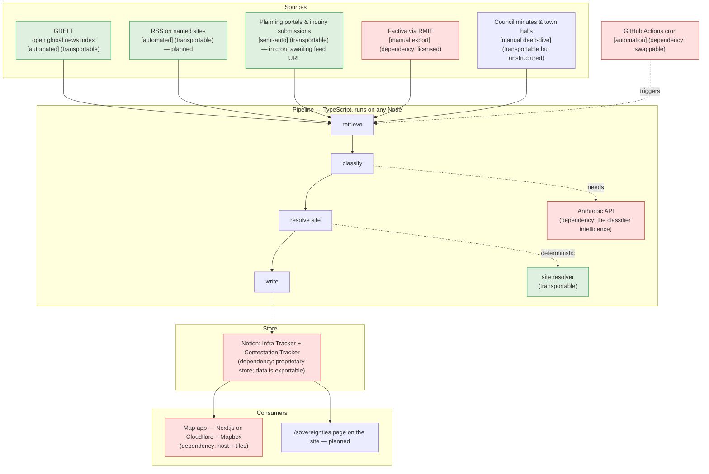

# Contestation system: what's set up

A map of the pieces, what's automated vs manual, and, through a sovereignty
lens, what you own and can move (transportable) versus what is an inbuilt
dependency on an external vendor or licence.

## Flow

## Sovereignty ledger

| Component | Automated / manual | Transportable or dependency | Notes |
|---|---|---|---|
| Pipeline code | automated | **Transportable** | Plain TypeScript, runs on any Node host. |
| Controlled vocabulary + classification contract | automated | **Transportable** | Yours; defined in `pipeline/config.ts`. |
| Site resolver | automated | **Transportable** | Deterministic matching, no vendor. |
| GDELT | automated | **Transportable** | Free, open global news index (see below). |
| Planning portals / inquiry submissions | semi-auto | **Transportable** | Public records. Runs in the fortnightly cron; no-ops until `PORTAL_FEED_URL` points at a confirmed feed. |
| Notion data | n/a | **Transportable** | Exportable to CSV / Markdown / JSON any time. |
| Notion (the platform + API) | n/a | Dependency | Proprietary store; your data isn't locked, the tooling is. |
| Anthropic API | automated | Dependency | Provides the classification intelligence. |
| Cloudflare | n/a | Dependency | Hosts the map; swappable for another host. |
| Mapbox | n/a | Dependency | Base map tiles; swappable (e.g. MapLibre). |
| Factiva (via RMIT) | manual export | Dependency | Licensed; terms forbid scraping. The least sovereign source. |
| GitHub Actions | automated | Dependency | CI host; swappable. |

**Reading it:** the *substance* — the code, the schema, the data, and the open
sources — is yours and movable. The *dependencies* are the intelligence
(Anthropic), the convenient store (Notion), the hosting (Cloudflare/Mapbox), and
one licensed source (Factiva). None traps your data; the lock-in is in tooling
and the model, which is exactly the sovereignty tension the project studies.

## What GDELT is

GDELT (the Global Database of Events, Language, and Tone) is a free, open
project that continuously monitors world news in many languages and indexes
each article with metadata (date, source country, themes, tone). The pipeline
queries its DOC 2.0 API for Australian articles that mention the tracked
infrastructure alongside contestation language. It's a wide net rather than a
precise instrument: hyperlocal Australian coverage is thin, so it complements
the planning portals and manual ingestion rather than replacing them. No
account or key needed; it rate-limits to about one request every five seconds.
Note its `sourcecountry` uses FIPS codes, where Australia is `AS` (not `AU`).
